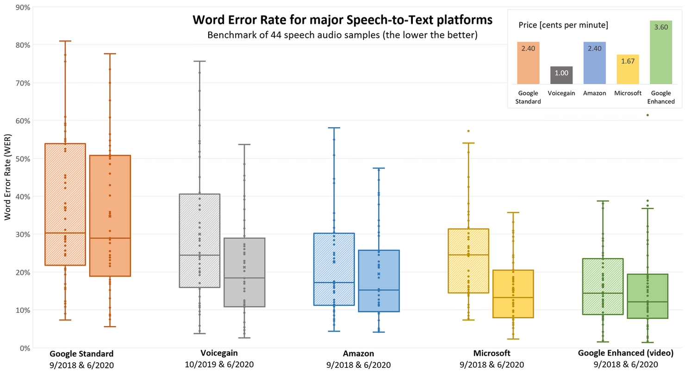

# Speech To Text Analyze

In this repo, the performances of tools that convert audio to text are compared by reporting their accuracy rates, speeds and features.

## [Speech-to-Text Accuracy Benchmark - June 2020 Results](https://www.voicegain.ai/post/speech-to-text-accuracy-benchmark-june-2020-results)

Accuracy of automated speech recognition (ASR) depends on the audio in many ways and the effect is not small. Basically, accuracy can be all over the place depending on factors like:
- Does the speech follow proper grammar or is the speaker making things up as they are saying it. Prepared speeches will have better, i.e. lower WER (word error rate) scores compared to unscripted speech.
- What is the subject of the speech. Rare and obscure words or word combinations, like e.g. people or other names, will make life difficult for the NLM (natural language model).
- Are there more than one speakers? Are they constantly switching over or even talk over one another.
- Is there music in the background - very common for youtube productions.
- Is there background noise? What is the type of noise?
- Are parts of the speech audio unusually slow or fast?
- Is there room reverb or echo in the recording?
- Is the recording volume very low. Are there variations in the recording volume (e.g. recorder placed on one edge of a very long table)
- Is the recording quality bad, e.g., due to a codec or insane archival compression levels.

### So what are the results? Who has the best recognizer?
Again, the best recognizer is not the right question, because it all depends on your actual speech audio it is used on.
- Every recognizer has improved. The biggest improvement in median WER was by Microsoft Speech to Text.
- The best recognizer in our data set was Google Speech to Text - Enhanced (video), but the new Microsoft Speech to Text is very close second.
- Taking price into consideration, Microsoft might be declared Best Buy
- Google Speech to Text - Standard, although somewhat improved, is still clearly the worst performing on the data set.    
- The single bad data point for Google Enhanced (video) is real. We ran repeated test on the file and got the same result. The old Google Enhanced recognizer did not have problems with that file.

## All speech-to-text Tools
1. Google API($) ✅
2. Amazon Transcribe($) ✅
3. Microsoft Azure Speech to Text($)
4. Web Speech API(Free) ✅
5. Dragon Professional Individual($)
6. Braina Pro($)
7. Speechnotes(Free)
8. e-Speaking($)
9. Voice Finger($)
10. Apple Dictation(Free)
11. Windows Dictations/Speech Recognition(Free)
12. Dictation(Free)
13. Speech Texter(Free)
14. Dragon Anywhere for Mobile($)
15. Otter(Free)
16. Verbit($)
17. Speechmatics($)
18. IBM Watson Speech to Text($)
19. Just Press Record(Free)
20. Transcribe(Free)
21. Voicegain($)

## Todos
- [ ] Search all speech-to-text tools
- [ ] Review all source codes
- [ ] Read doc or article all speech-to-text technologies
- [ ] Run some source code in local
- [ ] Test some tools
- [ ] Write report for all tools
- [ ] Compare all tools
- [ ] Write all features, infos tools

## Source Link

https://www.folio3.ai/blog/best-free-speech-to-text-software/
https://www.softwaretestinghelp.com/best-dictation-software/
https://www.google.com/search?q=compare+speech+to+text+tools&rlz=1C5CHFA_enTR972TR973&oq=compare+speech+to+text+tools&aqs=chrome..69i57j69i60l2.10431j0j7&sourceid=chrome&ie=UTF-8