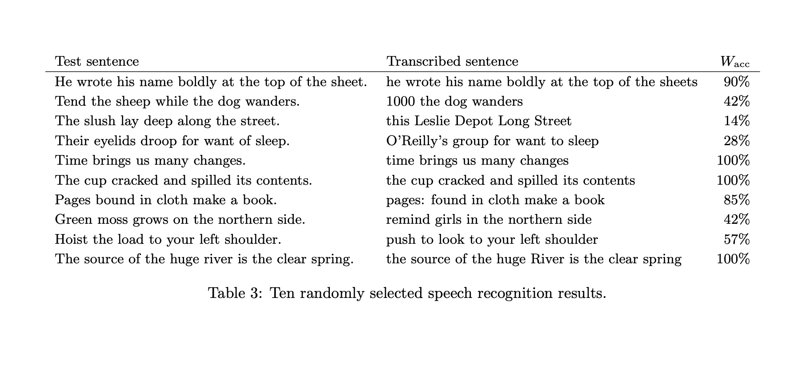
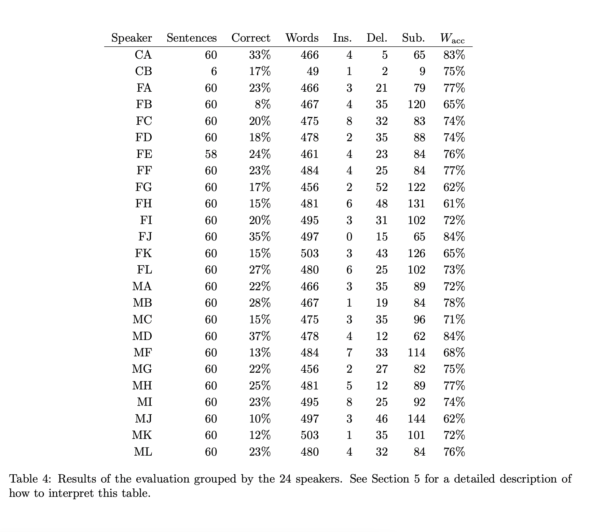

# Web API

[Web API Mozilla Developer Documantation](https://developer.mozilla.org/en-US/docs/Web/API/Web_Speech_API/Using_the_Web_Speech_API)

“
This technical report describes the current state of
the Web Speech API, which provides a JavaScript
interface for speech analysis and speech synthesis to
web applications. The focus lies on measuring the
performance of Google’s speech recognition web service that is behind the experimental API implementation in the Chromium browser. To this end, sentence correctness and word accuracy is measured using the TSP speech database with more than 1400
recordings of the Harvard sentences. The report also
puts the Web Speech API into historical context and
speculates about future prospects. A practical usecase is given that demonstrates how the API can be
used in a web application. Supplemental data and
the use-case is published online.
” - Web Speech API, Julius Adorf, May 27 2013

The Web Speech API covers both speech analysis and speech synthesis. In other words, it supports the conversion of speech to text and vice versa. The API is purely in JavaScript, which is currently one of the predominant client-side scripting languages of the web. A grammar can be given to the speech recognition system. The system can possibly take advantage of the constraints given by the grammar for improved speech recognition. It is written in the specification that the grammar format is still subject to discussion and not yet finished. - Web Speech API, Julius Adorf, May 27 2013

[Web Speech API Article ~ Julius Adorf](https://www.juliusadorf.com/pub/web-speech-api.pdf)

### Ten randomly selected speech recognition results.

The Web Speech API provides two distinct areas of functionality — speech recognition, and speech synthesis (also known as text to speech, or tts) — which open up interesting new possibilities for accessibility, and control mechanisms. This article provides a simple introduction to both areas, along with demos.